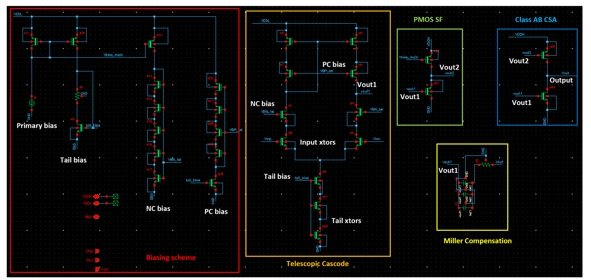
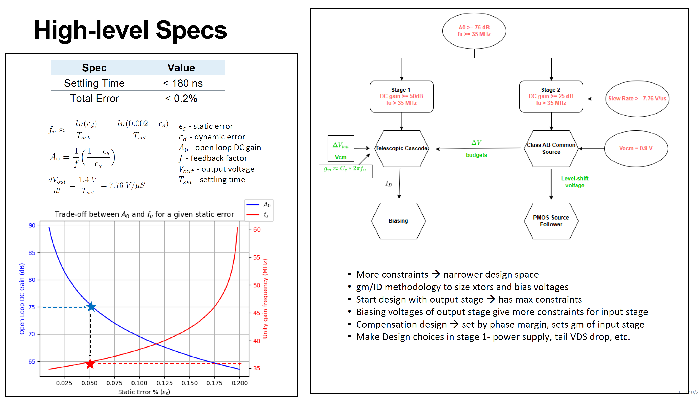
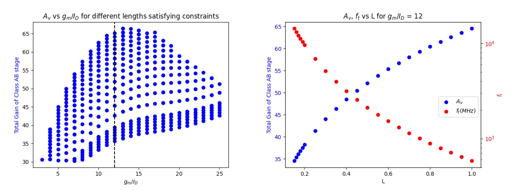

# EE240A: Final Project
### Project report on my opamp design for an LCD sub-pixel display driver for EE240A class at UC Berkeley

## Introduction

This report presents the design and implementation of an amplifier tailored for driving a specific
LCD sub-pixel in a smartwatch application. The subsequent sections detail the complete design
flow, beginning at the derivation of high-level design metrics from the given specifications, preliminary
design calculations, and the realization of a functional design. The final design meets
all specified requirements, as summarized in the table below.

| Parameter                       | Target Spec | Design Spec     |
|----------------------------------|-------------|-----------------|
| Settling Time (Tset)            | ≤ 180 ns    | 159.2 ns (-%) |
| Total error                     | ≤ 0.2%      | ≤ 0.1%          |
| Power Consumption               | ≤ 1.5 mW    | 0.31 mW (-%)  |
| CMRR at DC                      | ≥ 70 dB     | 70 dB        |
| PSRR (VDDL) at DC               | ≥ 50 dB     | 51 dB        |
| PSRR (VDDH) at DC               | ≥ 50 dB     | 64 dB        |
| Phase Margin (PM)               | ≥ 45°       | 51.53°          |
| Figure of Merit                 | ≥ 3.70      | 20.08 (+%)   |

## Op-amp Overview
- **2-Stage Op-Amp with Miller Compensation**
- **Input Stage**: Telescopic Cascode for high gain  
- **Output Stage**: Class-AB common source for improved slew rate

## From Key Specifications to Initial Design Parameters

Settling time (**Tset**) and the error budget (**ϵbud**) provide a starting point for our design. With a refresh rate of 60 Hz and a display resolution of 272 x 340 pixels, Tset is calculated as:

**Tset = 1 / (Refresh rate × Resolution)  = 1 / (60 × (272 × 340))  ≈ 180 ns**

For a given feedback factor (f), the minimum open-loop DC gain (A0) is:

**A0 = 1 / f * ((1 - ϵs) / ϵs)**

Considering constraints on phase margin (PM) and Tset, the unity gain frequency (fu) is:

**fu ≈ -ln(ϵd) / Tset  = -ln(0.002 - ϵs) / Tset**

(Left) The plot below illustrates the minimum A0 and fu for the op-amp based on a specific partitioning of the error budget. A design decision was made to prioritize a higher-gain op-amp over a higher fu. This choice leads to an unequal distribution of the error budget, as indicated by the star in the plot.

(Right) With these design parameters established, topology selection was guided by additional constraints, including slew rate, predefined output and input common-mode voltages, and the voltage drop across the tail current source in the first stage, among others. The 
**gm/ID methodology** was employed to determine the optimal sizing for each transistor in the core amplifier and to identify the corresponding bias points, as outlined in the flowchart above.

## Class-AB Common Source Design

Since the second stage has more constraints, it was designed first using the gm/ID methodology. For the following constraints, we can use the given look-up tables (LUTs) to size our transistors in this stage

A0 ≥ 30

fu ≥ 35 MHz

VDS,n = VDS,p = 0.9 V

VDDH = 1.8 V

The gm/ID search space was defined within the range of 3 to 25, and the full range of transistor lengths available in the LUTs, spanning from 150 nm to 10 μm, was considered. The left plot below illustrates the values of gm/ID that meet the specified conditions. Each point on the plot corresponds to a different transistor length for a given gm/ID that satisfies the constraints. To mitigate variations and avoid short-channel effects, such as drain-induced barrier lowering, the transistor lengths were primarily set to 1 μm wherever feasible.

The first design choice was made here to choose a gm/ID of 12 as shown by the dotted line in the above figure. To size the transistors, this estimate of gm was then utilized

gm = 2πfuCL

where CL represents the load model that needs to be driven for the sub-pixel.

## Telescopic Cascode Design

## Biasing

## Miller Compensation

## Results - Frequency Response

## Results - Transient Response

## Potential Improvements
