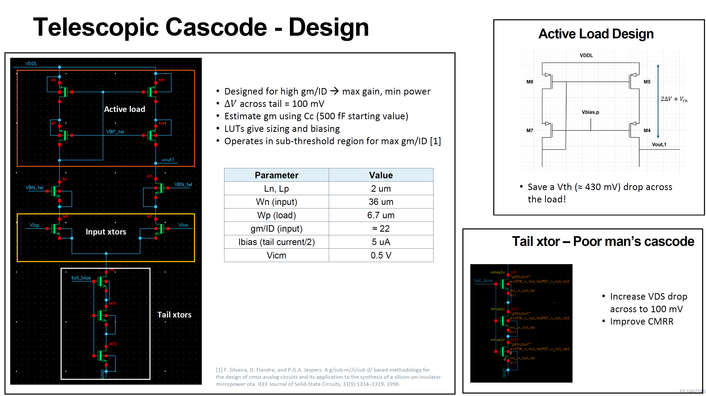
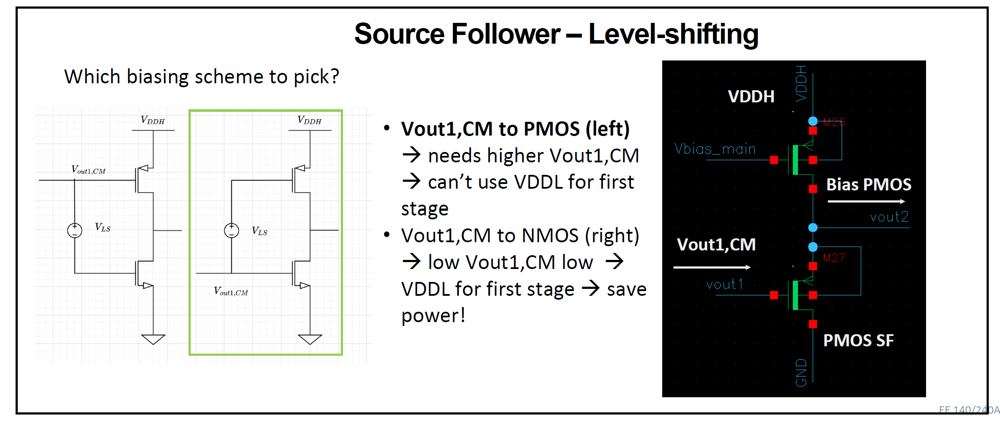
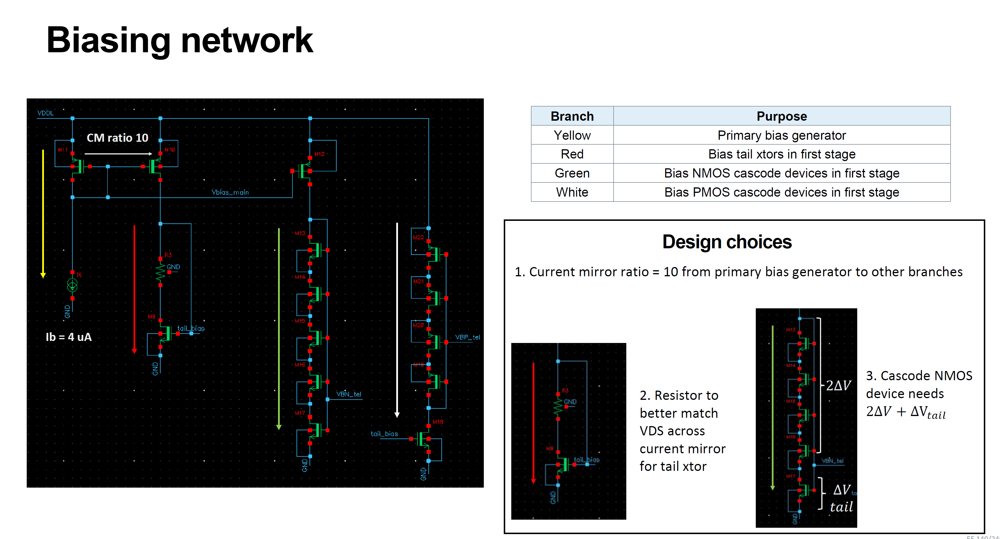
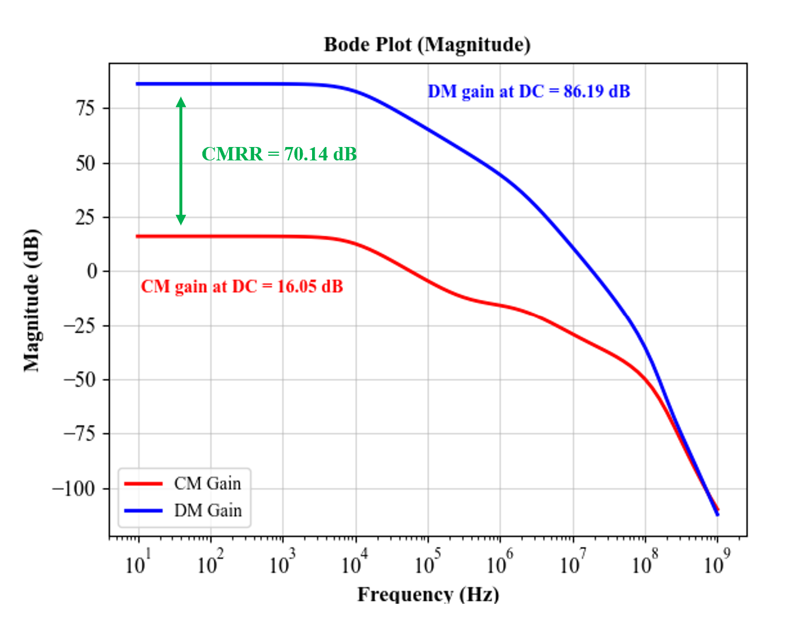
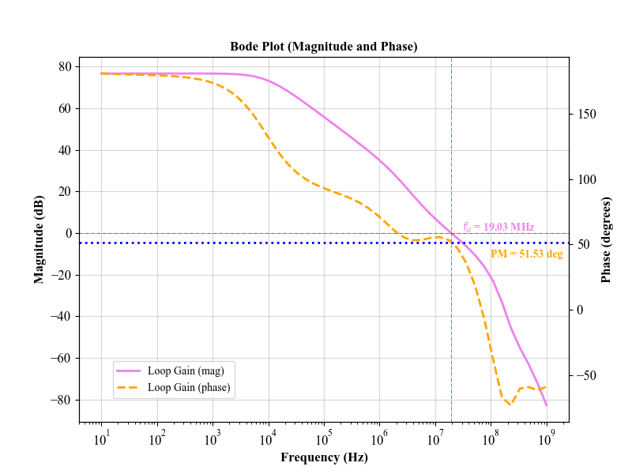
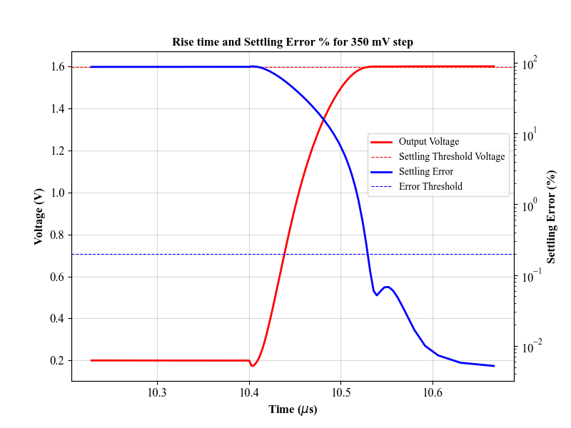
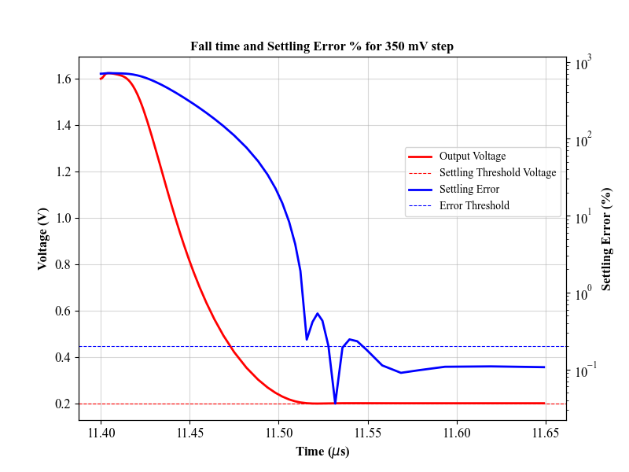
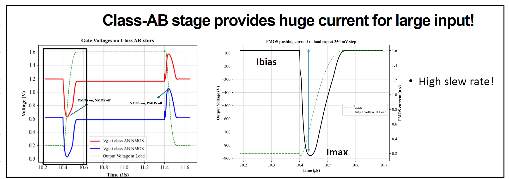

# EE240A: Final Project
### Project report on my opamp design for an LCD sub-pixel display driver for EE240A class at UC Berkeley

## Introduction

This report presents the design and implementation of an amplifier tailored for driving a specific
LCD sub-pixel in a smartwatch application. The subsequent sections detail the complete design
flow, beginning at the derivation of high-level design metrics from the given specifications, preliminary
design calculations, and the realization of a functional design. The final design meets
all specified requirements, as summarized in the table below.

| Parameter                       | Target Spec | Design Spec     |
|----------------------------------|-------------|-----------------|
| Settling Time (Tset)            | ≤ 180 ns    | 159.2 ns (-%) |
| Total error                     | ≤ 0.2%      | ≤ 0.1%          |
| Power Consumption               | ≤ 1.5 mW    | 0.31 mW (-%)  |
| CMRR at DC                      | ≥ 70 dB     | 70 dB        |
| PSRR (VDDL) at DC               | ≥ 50 dB     | 51 dB        |
| PSRR (VDDH) at DC               | ≥ 50 dB     | 64 dB        |
| Phase Margin (PM)               | ≥ 45°       | 51.53°          |
| Figure of Merit                 | ≥ 3.70      | 20.08 (+%)   |

## Op-amp Overview
- **2-Stage Op-Amp with Miller Compensation**
- **Input Stage**: Telescopic Cascode for high gain  
- **Output Stage**: Class-AB common source for improved slew rate

## From Key Specifications to Initial Design Parameters

Settling time (**Tset**) and the error budget (**ϵbud**) provide a starting point for our design. With a refresh rate of 60 Hz and a display resolution of 272 x 340 pixels, Tset is calculated as:

**Tset = 1 / (Refresh rate × Resolution)  = 1 / (60 × (272 × 340))  ≈ 180 ns**

For a given feedback factor (f), the minimum open-loop DC gain (A0) is:

**A0 = 1 / f * ((1 - ϵs) / ϵs)**

Considering constraints on phase margin (PM) and Tset, the unity gain frequency (fu) is:

**fu ≈ -ln(ϵd) / Tset  = -ln(0.002 - ϵs) / Tset**

(Left) The plot below illustrates the minimum A0 and fu for the op-amp based on a specific partitioning of the error budget. A design decision was made to prioritize a higher-gain op-amp over a higher fu. This choice leads to an unequal distribution of the error budget, as indicated by the star in the plot.

(Right) With these design parameters established, topology selection was guided by additional constraints, including slew rate, predefined output and input common-mode voltages, and the voltage drop across the tail current source in the first stage, among others. The 
**gm/ID methodology** was employed to determine the optimal sizing for each transistor in the core amplifier and to identify the corresponding bias points, as outlined in the flowchart above.

## Class-AB Common Source Design

Since the second stage has more constraints, it was designed first using the gm/ID methodology. For the following constraints, we can use the given look-up tables (LUTs) to size our transistors in this stage

A0 ≥ 30

fu ≥ 35 MHz

VDS,n = VDS,p = 0.9 V

VDDH = 1.8 V

The gm/ID search space was defined within the range of 3 to 25, and the full range of transistor lengths available in the LUTs, spanning from 150 nm to 10 μm, was considered. The left plot below illustrates the values of gm/ID that meet the specified conditions. Each point on the plot corresponds to a different transistor length for a given gm/ID that satisfies the constraints. To mitigate variations and avoid short-channel effects, such as drain-induced barrier lowering, the transistor lengths were primarily set to 1 μm wherever feasible.

The first design choice was made here to choose a gm/ID of 12 as shown by the dotted line in the above figure. To size the transistors, this estimate of gm was then utilized

gm = 2πfuCL

where CL represents the load model that needs to be driven for the sub-pixel.

## Telescopic Cascode Design

To conserve power, I opted to use VDDL (1.1 V) for the first stage. This decision introduced an additional constraint, further narrowing the design space for the first stage. On the PMOS active load side, I opted for a low-voltage cascode current mirror, as shown below. This choice reduces the voltage drop by Vth, increasing the total voltage budget at the output of the first stage. The transistors in this stage were designed for a high-gm/ID to maximize gain while reducing power consumption. This meant that the transistors operated in sub-threshold region. A drop of 100 mV was chosen across the tail transistors. To improve CMRR, a 'poor-man's cascode' configuration was used for the tail transistors. 

## Source-Follower for Level-Shifting

The second-stage has 2 input devices since its of class-AB. The output of the first stage was connected to the NMOS directly and a PMOS source follower was used to level-shift the voltage up to bias the PMOS in the class-AB stage as shown below. 

## Biasing

The following biasing network was used to generate the various biases required for each stage, including the source follower level-shifter. A maximum current-mirror ratio of 10 was allowed for the design, and it was used to mirror the current from the primary bias generator to all the other branches.

## Miller Compensation

A standard Miller compensation capacitor, Cc, and a resistor, **Rc**, were connected between the outputs of the two stages, as shown in Fig. 8. With **gm,output** representing the total gm of the
class AB stage, **Rc** was calculated to push the right-half-plane (RHP) zero associated with the
compensation technique to infinity using the following formula:

**Rc ≈ 1/gm,output**

## Results - Frequency Response

This section summarizes the frequency response of the op-amp. 

| Parameter                         | Target/Calculated Spec | Design Spec | Change  |
|------------------------------------|------------------------|-------------|---------|
| DM gain at DC (A0)                 | 77.50 dB               | 86.19 dB    | ↑       |
| CMRR at DC                         | ≥ 70 dB                | 70.14 dB    | ↔       |
| PSRR (VDDL) at DC                  | ≥ 50 dB                | 51.53 dB    | ↔       |
| PSRR (VDDH) at DC                  | ≥ 50 dB                | 62.42 dB    | ↑       |
| Phase Margin                       | ≥ 45°                  | 51.53°      | ↔       |
| Unity Gain Frequency (fu)         | 35 MHz                 | 19.03 MHz   | ↓       |

The common-mode and differential-mode gains are plotted below and the CMRR is marked. 

 

The loop-gain of the op-amp in negative feedback (given to us) is shown below.

 

The design meets all the specs. 

## Results - Transient Response

This section summarizes the time-domain response of the op-amp. 

| Parameter                    | 5 mV input step | 350 mV input step |
|------------------------------|-----------------|-------------------|
| Rise Time                    | 104.6 ns        | 152.5 ns          |
| Fall Time                    | 102.9 ns        | 159.2 ns          |
| Settling Time                | 104.6 ns        | 159.2 ns          |
| SR+ max                       | -               | 17.6 V/us         |
| SR- max                       | -               | 17.2 V/us         |
| CE (Imax/Ibias)              | -               | 10.66             |
| Error                        | < 0.1%          | < 0.1%            |
| Avg Power (VDDL)             | 0.110 mW        | 0.110 mW          |
| Avg Power (VDDH)             | 0.154 mW        | 0.202 mW          |
| Avg Total Power              | 0.264 mW        | 0.312 mW          |
| FoM                           | 36.10           | 20.08             |

Rise time for a 350 mV input step and the corresponding settling error (0.2% threshold) is shown here. Note that the feedback loop sets the ideal closed-loop gain to 2.

 

Fall time for a 350 mV input step and the corresponding settling error (0.2% threshold) is shown here.

 

Just as a sanity check, the gate voltages on the class-AB stage were plotted as a function of time for a given period, and the corresponding maximum current draw is also shown. This proves that our design choice to use a class-AB stage helped in achieving a high slew rate. 

 

## Area

The total area of the design was calculated by multiplying the length and width of each transistor and passive component. The entire amplifier occupies an area of 975.9 μm2. Given that each sub-pixel is driven by one such amplifier, the total area occupied by the LCD driver can be calculated as follows:

**Total Area = #Sub-pixels × Resolution × Area of single amplifier = 3 × 272 × 340 × 975.9μm2 = 270.7 mm2**

A typical 38 mm Apple Watch Series 1, which has the same resolution (though with an OLED display instead), has a display area of 564 mm2. Therefore, the entire LCD driver unit occupies approximately 48% of the display area. This is certainly quite large and presents an opportunity for optimization.

## Potential Improvements

